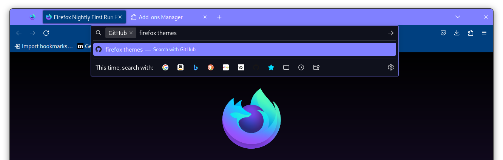

## Description

A Firefox theme with the SubSeven color palette. Currently this is just a `src/manifest.json` file, but future iterations may include CSS-enhanced alternatives to choose from.

## Installation

This theme is pending review on the Mozilla add-ons hub.

In the meantime, you can install the unsigned theme using the `.xpi` file from the [latest release](https://github.com/mattkeeler/firefox-subseven-theme/releases/latest). Unsigned themes can be installed in two ways:

- temporarily via `about:debugging#/runtime/this-firefox`
- permanently by using a build like [developer edition](https://www.mozilla.org/en-US/firefox/developer/) or [nightly](https://www.mozilla.org/en-US/firefox/112.0a1/releasenotes/), and setting `xpinstall.signatures.required = false` in `about:config`

## Contributing

> 🪝 Save cycle time by using this repo's [pre-commit](https://pre-commit.com/) hooks: `pre-commit install`

New to firefox extension/theme development like me? These resources I used to get started:

- [Theme creation basics](https://extensionworkshop.com/documentation/themes/) - start here
- Developer docs on [manifest.json](https://developer.mozilla.org/en-US/docs/Mozilla/Add-ons/WebExtensions/manifest.json), particularly the [theme](https://developer.mozilla.org/en-US/docs/Mozilla/Add-ons/WebExtensions/manifest.json/theme) section
- [Firefox extension .xpi file structure: description, contents, creation, and installation](https://stackoverflow.com/questions/30865644/firefox-extension-xpi-file-structure-description-contents-creation-and-inst/31043045#31043045)
- [Getting started with web-ext](https://extensionworkshop.com/documentation/develop/getting-started-with-web-ext/) - cli tool designed to speed up various parts of the extension development process
- [Extensions and the add-on ID](https://extensionworkshop.com/documentation/develop/extensions-and-the-add-on-id/)
